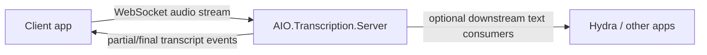

<div align="center">

# AIO.Transcription.Server

**A clean, reusable real-time transcription backend for AI Orchestra apps**

*Stream audio in. Get transcript events out.*

</div>

## Why this exists

`AIO.Transcription.Server` is the machine-side transcription service.

It is intentionally **not** tied to InterviewAssistant.
That makes it reusable across:

- interview support
- meeting tooling
- operator consoles
- other AI Orchestra voice workflows

## Current implementation

This repo now contains a real v2 server path:

- ASP.NET Core service targeting `.NET 10`
- WebSocket endpoint for incoming audio sessions
- session registry
- audio windowing
- whisper.cpp transcription through `Whisper.net`
- transcript event emission
- simulation path for downstream testing

## Architecture



## Endpoints

- `GET /healthz`
- `GET /sessions`
- `WS /ws/transcribe`

`/healthz` also reports the configured `urls` value so you can confirm which binding the server was started with.

## Host binding / port configuration

Default self-host binding:

```json
{
  "Hosting": {
    "urls": "http://127.0.0.1:43071"
  }
}
```

You can override it in any normal ASP.NET Core way, for example:

- `appsettings.json`
- environment variable: `Hosting__Urls=http://0.0.0.0:43071`
- command line: `--Hosting:Urls=http://127.0.0.1:43100`

Examples:

```bash
dotnet run --project src/AIO.Transcription.Server -- --Hosting:Urls=http://127.0.0.1:43100
```

```powershell
$env:Hosting__Urls = "http://0.0.0.0:43071"
dotnet AIO.Transcription.Server.dll
```

## Windows IIS hosting

If the target Windows machine already has IIS, this server can be hosted as a normal ASP.NET Core IIS site.

Recommended shape:

1. Install the matching **ASP.NET Core Hosting Bundle** on the Windows machine.
2. Publish the server.
3. Create an IIS site pointing at the publish folder.
4. Use the generated `web.config` and let ASP.NET Core Module launch the app.

Example publish command:

```bash
dotnet publish src/AIO.Transcription.Server/AIO.Transcription.Server.csproj -c Release -r win-x64 --self-contained false -o publish/win-x64
```

Notes:

- In IIS mode, IIS owns the public binding/port.
- The app still keeps the same paths:
  - `/healthz`
  - `/sessions`
  - `/ws/transcribe`
- The desktop client should then use the IIS site base URL instead of a localhost Kestrel port if you expose it that way.

## Linux service hosting

If you want classic Linux self-hosting, use a supervisor such as `systemd` and point it at the published app. In that mode `Hosting:Urls` controls the bind address/port.

## Protocol shape

### Client → server

```json
{
  "type": "start-session",
  "sessionId": "demo-1",
  "encoding": "f32le",
  "sampleRate": 48000,
  "channels": 2
}
```

```json
{
  "type": "audio-chunk",
  "sessionId": "demo-1",
  "sequence": 1,
  "audioBase64": "...",
  "encoding": "f32le",
  "sampleRate": 48000,
  "channels": 2
}
```

```json
{
  "type": "simulate-text",
  "sessionId": "demo-1",
  "simulatedText": "Can you explain the tradeoff here?",
  "isFinalChunk": true
}
```

### Server → client

```json
{
  "type": "transcript",
  "sessionId": "demo-1",
  "message": "Transcript updated.",
  "transcriptText": "Can you explain the tradeoff here?",
  "isFinal": false
}
```

## Solution layout

```text
src/
  AIO.Transcription.Server.Contracts/
  AIO.Transcription.Server/
```

## Design notes

- Real STT wiring is present in source.
- The current implementation transcribes when the pending audio window reaches the configured threshold.
- `simulate-text` remains available to exercise clients before real machine deployment.

## Status

Server v2 flow is implemented in source.
Local build verification is still blocked on this machine because `dotnet` is not installed here.
