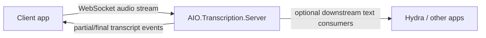

<div align="center">

# AIO.Transcription.Server

**A clean, reusable real-time transcription backend for AI Orchestra apps**

*Stream audio in. Get transcript events out.*

</div>

## Why this exists

`AIO.Transcription.Server` is the machine-side transcription service.

It is intentionally **not** tied to InterviewAssistant.
That makes it reusable across:

- interview support
- meeting tooling
- operator consoles
- other AI Orchestra voice workflows

## Current implementation

This repo now contains a real v2 server path:

- ASP.NET Core service targeting `.NET 10`
- WebSocket endpoint for incoming audio sessions
- session registry
- rolling live audio buffering
- VAD-controlled utterance endpointing
- whisper.cpp transcription through `Whisper.net`
- explicit partial/final transcript event emission
- simulation path for downstream testing

## Architecture



## Endpoints

- `GET /healthz`
- `GET /sessions`
- `WS /ws/transcribe`

## Protocol shape

### Client -> server

```json
{
  "type": "start-session",
  "sessionId": "demo-1",
  "modelType": "medium.en",
  "prompt": "Names: Kaizen, Hydra. Stack: .NET, gRPC.",
  "encoding": "f32le",
  "sampleRate": 48000,
  "channels": 2
}
```

```json
{
  "type": "audio-chunk",
  "sessionId": "demo-1",
  "sequence": 1,
  "audioBase64": "...",
  "encoding": "f32le",
  "sampleRate": 48000,
  "channels": 2
}
```

```json
{
  "type": "simulate-text",
  "sessionId": "demo-1",
  "simulatedText": "Can you explain the tradeoff here?",
  "isFinalChunk": true
}
```

`sessionId` is client-owned. The transcription server uses the provided value only as the live audio-session label and correlation ID. It does not interpret that ID as persisted interview state and does not implement restore or reopen behavior from it.

Multiple live transcription sessions are allowed. A single websocket can carry more than one live session when client messages route work by `sessionId`. Raw binary audio frames remain valid only when exactly one live session is active on that websocket.

### Server -> client

```json
{
  "type": "partial-transcript",
  "sessionId": "demo-1",
  "utteranceId": "demo-1-000001",
  "sequence": 1,
  "transcriptText": "can you explain the tradeoff",
  "modelType": "base.en",
  "receivedChunkCount": 4,
  "receivedAudioBytes": 384000
}
```

```json
{
  "type": "final-transcript",
  "sessionId": "demo-1",
  "utteranceId": "demo-1-000001",
  "transcriptText": "Can you explain the tradeoff here?",
  "modelType": "base.en",
  "receivedChunkCount": 8,
  "receivedAudioBytes": 768000
}
```

See [docs/live-transcription-contract.md](docs/live-transcription-contract.md) for the authoritative client contract.

## Solution layout

```text
src/
  AIO.Transcription.Server.Contracts/
  AIO.Transcription.Server/
```

## Design notes

- Real STT wiring is present in source.
- Incoming audio chunks are transport units only; the server owns rolling partial windows and VAD-controlled final utterance boundaries.
- `simulate-text` remains available to exercise clients before real machine deployment.
- The same client `sessionId` can be shared with Hydra guidance, but persisted session restore semantics belong to Hydra, not to this transcription server.
- JSON protocol messages are the preferred path for multiplexing multiple live sessions over one websocket because they carry `sessionId` explicitly.

## Status

Server v2 flow is implemented in source and builds locally with `dotnet build`.
