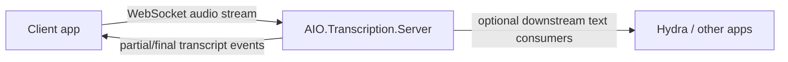

<div align="center">

# AIO.Transcription.Server

**A clean, reusable real-time transcription backend for AI Orchestra apps**

*Stream audio in. Get transcript events out.*

</div>

## Why this exists

`AIO.Transcription.Server` is the machine-side transcription service.

It is intentionally **not** tied to InterviewAssistant.
That makes it reusable across:

- interview support
- meeting tooling
- operator consoles
- other AI Orchestra voice workflows

## Current implementation

This repo now contains a real v2 server path:

- ASP.NET Core service targeting `.NET 10`
- WebSocket endpoint for incoming audio sessions
- session registry
- audio windowing
- whisper.cpp transcription through `Whisper.net`
- transcript event emission
- simulation path for downstream testing

## Architecture



## Endpoints

- `GET /healthz`
- `GET /sessions`
- `WS /ws/transcribe`

## Protocol shape

### Client → server

```json
{
  "type": "start-session",
  "sessionId": "demo-1",
  "encoding": "f32le",
  "sampleRate": 48000,
  "channels": 2
}
```

```json
{
  "type": "audio-chunk",
  "sessionId": "demo-1",
  "sequence": 1,
  "audioBase64": "...",
  "encoding": "f32le",
  "sampleRate": 48000,
  "channels": 2
}
```

```json
{
  "type": "simulate-text",
  "sessionId": "demo-1",
  "simulatedText": "Can you explain the tradeoff here?",
  "isFinalChunk": true
}
```

### Server → client

```json
{
  "type": "transcript",
  "sessionId": "demo-1",
  "message": "Transcript updated.",
  "transcriptText": "Can you explain the tradeoff here?",
  "isFinal": false
}
```

## Solution layout

```text
src/
  AIO.Transcription.Server.Contracts/
  AIO.Transcription.Server/
```

## Design notes

- Real STT wiring is present in source.
- The current implementation transcribes when the pending audio window reaches the configured threshold.
- `simulate-text` remains available to exercise clients before real machine deployment.

## Status

Server v2 flow is implemented in source.
Local build verification is still blocked on this machine because `dotnet` is not installed here.
